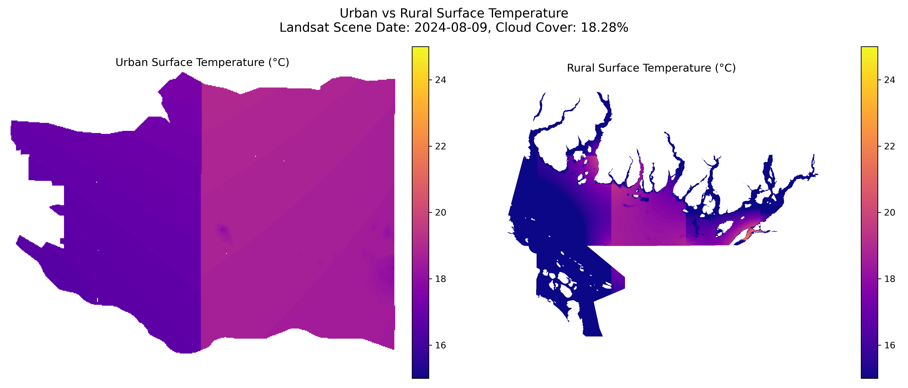
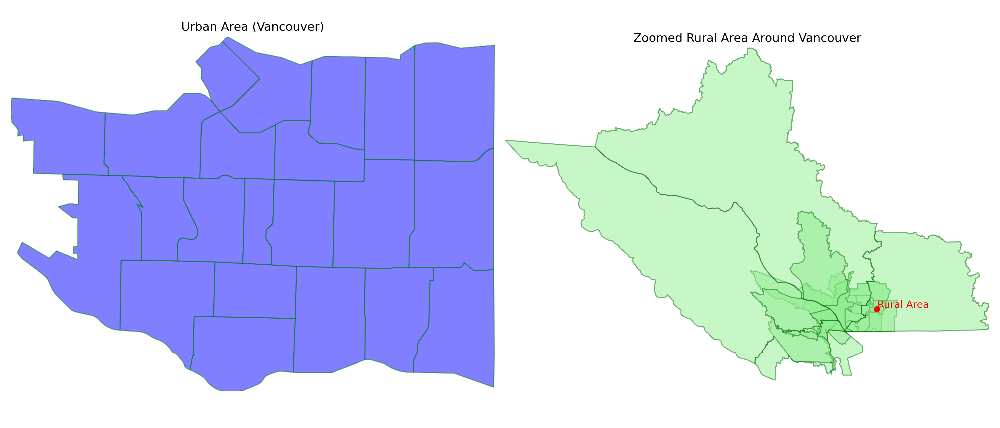
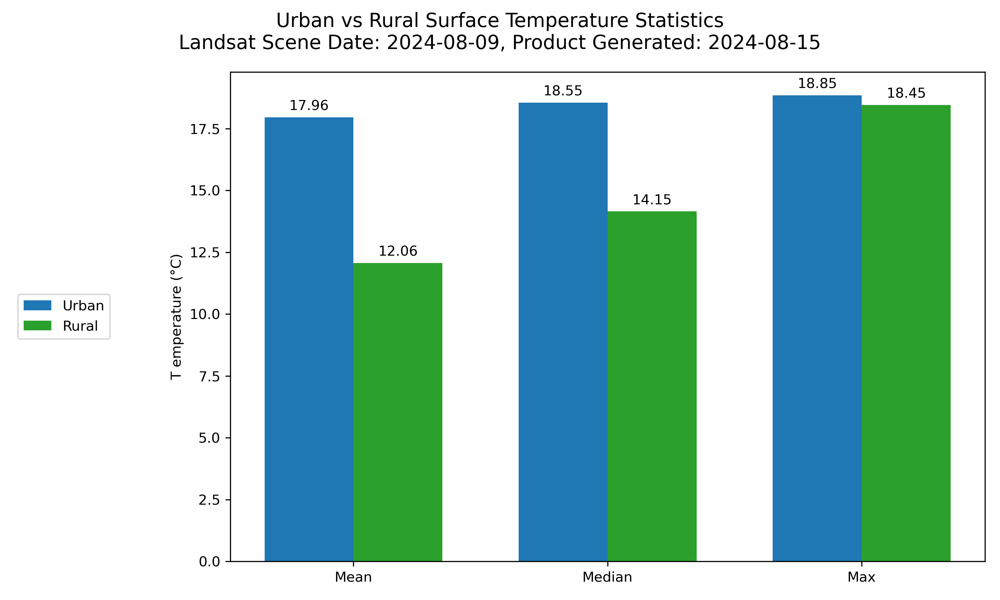

# Urban-vs-Rural-Temperature-Analysis

Python GIS analysis of Landsat data comparing urban vs rural land surface temperature (LST), with maps, plots, and CSV outputs using **Landsat 8/9 satellite imagery** and **Python GIS tools**.

---

## Data

- Landsat 8/9 Level-2 Surface Temperature TIFF
- Urban and rural boundary GeoJSON files
- Metadata included:
  - Scene Date: 2024-08-09
  - Product Generated: 2024-08-15
  - Day/Night: DAY
  - Land Cloud Cover: 18.28%
  - Scene Cloud Cover: 15.57%

---
## 📂 Data Sources
- **Landsat 8 Surface Temperature (GeoTIFF):**  
  [USGS EarthExplorer – LC80470262025192LGN00](https://earthexplorer.usgs.gov/scene/metadata/full/5e83d14f2fc39685/LC80470262025192LGN00/)  

- **Rural Administrative Boundaries (GeoJSON):**  
  [BC Data Catalogue – Legally Defined Administrative Areas](https://catalogue.data.gov.bc.ca/dataset/legally-defined-administrative-areas-of-bc)  

*(Due to large file sizes, the datasets are not stored in this repository. Please download them from the above links before running the code.)*  


## Tools & Libraries

- Python 3.x  
- rasterio  
- geopandas  
- matplotlib  
- numpy  
- pandas  

---

## Results

### 1️⃣ Urban vs Rural Temperature Maps



### 2️⃣ Urban and Zoomed Rural Area Maps



### 3️⃣ Urban vs Rural Surface Temperature Bar Plot



### 4️⃣ CSV File with Statistics

- Saved as `output/urban_rural_LST_stats.csv`
- Example content:

| Statistic | Urban_LST_C | Rural_LST_C |
|-----------|------------|------------|
| Mean      | 17.96      | 12.06      |
| Median    | 18.55      | 14.15      |
| Max       | 18.95      | 22.15      |

---

## Usage

```bash
# Run the analysis
python pyscript.py
